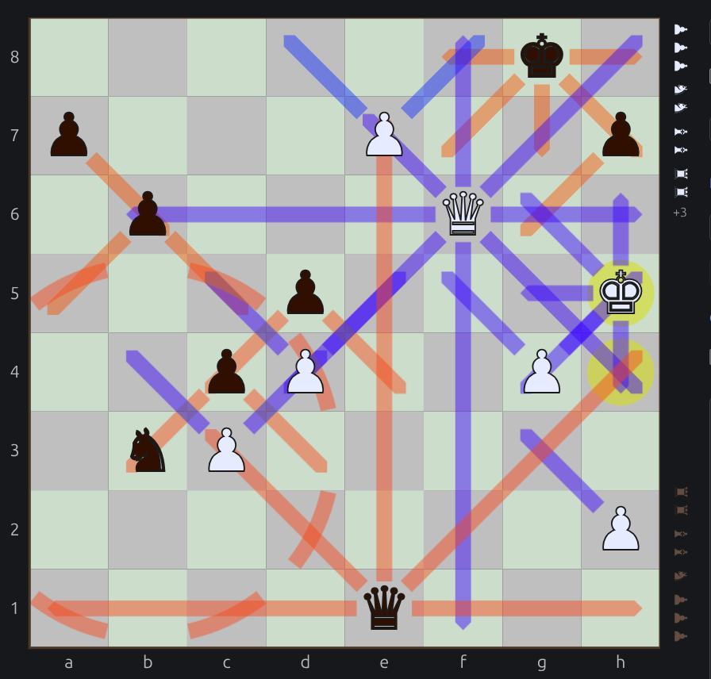
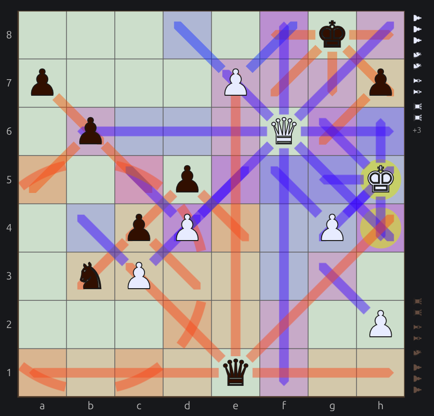
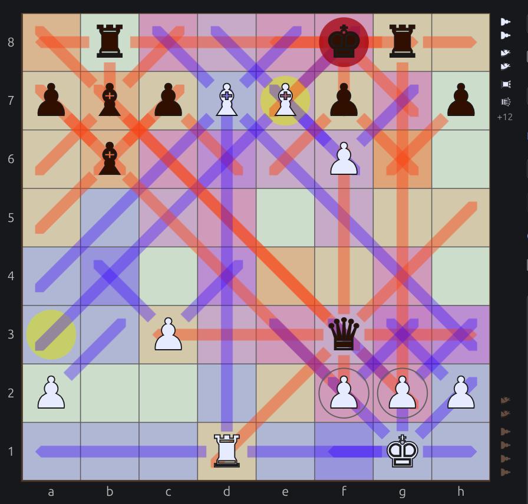
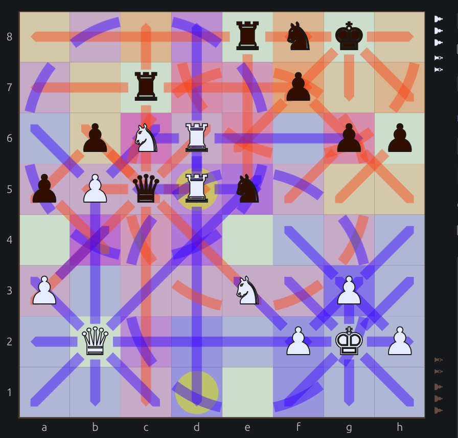

# Chess Visualizer

## See the board. Spot the threats. Blunder less.

Love chess but hate missing the obvious?

**Put your right brain to work alongside your left.** Chess Visualizer reveals the structure of a position at a glance: critical, weak, and contested squares—and how pieces attack, support, and constrain one another.

### Features

- **Attack rays** — see exactly which squares every piece attacks.

  

- **Attack heatmap** — color-shaded squares by attacking side and pressure intensity.

  

- **Fully customizable visualization** — configure every color and nearly every aspect of the visualization geometry.

- **It takes two to tango** — play online with a friend, resume an existing game, play with odds, and allow takebacks.

- **Classic games and PGN / FEN support** — explore famous games from the built-in library, import and export games and positions in PGN / FEN format.

- **And plenty more.**

[Try Chess Visualizer online](https://chess-visualizer.ivan-a87.workers.dev).

Chess Visualizer is open source and released under the [MIT License](LICENSE).

Give it a try, share your thoughts, and enjoy the game!

Like this project? You can [♥$ support](https://github.com/sponsors/ivan-veselovsky) the developer.

## More screenshots

Anderssen - Dufresne 1852

Reti - Capablanka 1924

