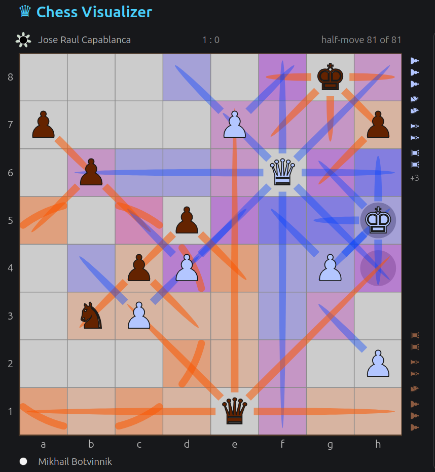

# Chess Visualizer

## Play without blunders. See the board. Spot the threats. Plan attacks.

Love chess but hate missing the obvious?

### Put visual intuition to work alongside analysis.

Chess Visualizer is an educational tool that reveals the structure of a position at a glance: critical, weak, and contested squares—and how pieces attack, support, and constrain one another.

### Features

- **Attack rays and a heatmap** — see exactly which squares every piece attacks.
  

- **Fully customizable visualization** — configure every color and nearly every aspect of its geometry.

- **It takes two to tango** — play online with a friend—no sign-up required; play several games in parallel; play with odds or from a non-standard position; and enable takebacks.

- **Classic games and PGN/FEN support** — explore famous games from the built-in library, and import or export games in PGN and positions in FEN.

- **And plenty more** — autoplay games, share a position or game via a link, see the material balance on the captured-pieces bar, or stash one game while you look at another.

Learn. Play. Enjoy!

**Give it a try and share your thoughts!**

### [Try Chess Visualizer online](https://chess-visualizer.ivan-a87.workers.dev)

Chess Visualizer is open source and released under the [MIT License](LICENSE).

Like this project? You can [support the developer ♥$](https://github.com/sponsors/ivan-veselovsky).

## More screenshots

Adolf Anderssen – Jean Dufresne, 1852

Richard Réti – José Raúl Capablanca, 1924

## Development

    npm install
    npm run dev        # the visualizer alone
    npm run build && npx wrangler dev   # ...with the two-player server
    npm test           # unit tests;  ./test-local.sh runs the protocol suites
